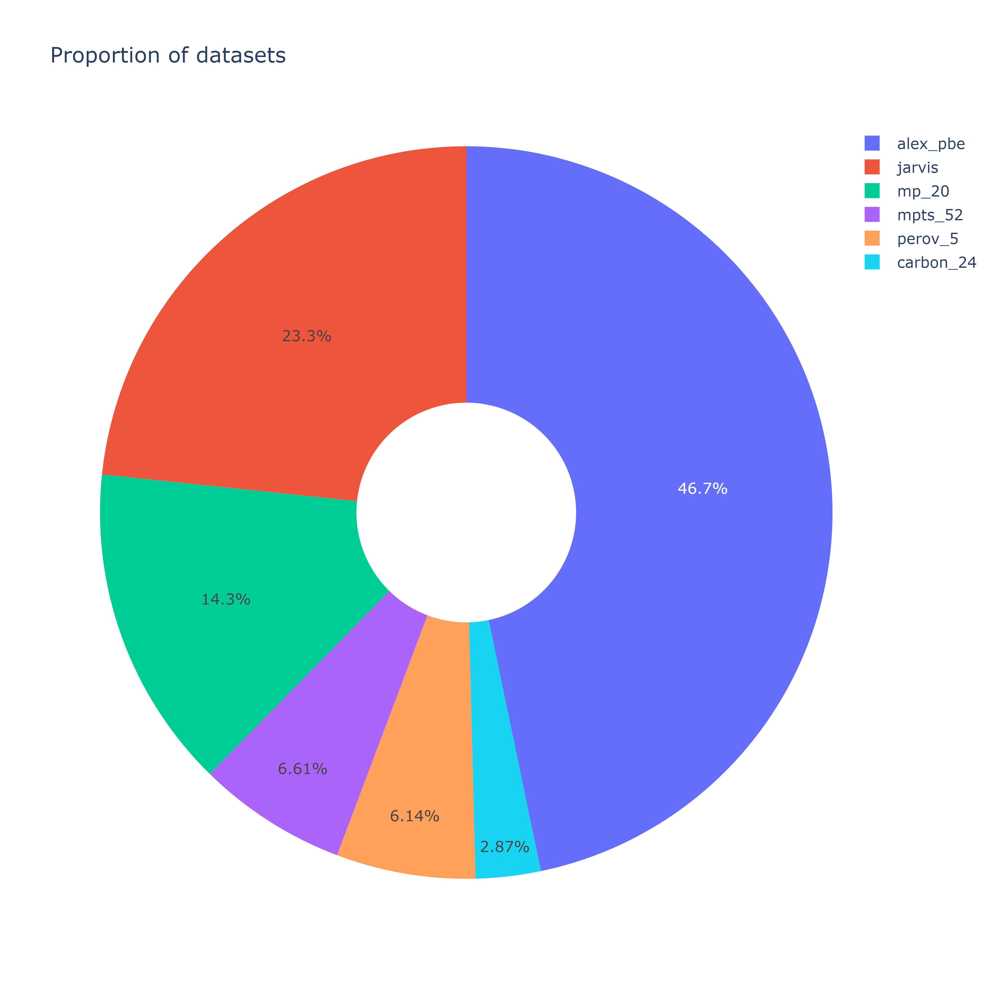

# Dataset genCry
Our dataset is a combination of datasets such as: [Alexandria](alexandria/), [carbon_24](carbon_24/), [Jarvis](Jarvis/), [MP_20](mp_20/), [MPTS_52](mpts_52/), [perov_5](perov_5/). The page for each dataset gives you a better look at it. These datasets were chosen because they contain relaxed stable crystals. The stability of the crystals will increase the accuracy of generating stable compounds later on. There are 308231 crystals in the dataset, with the features shown in the table below.

| material_id | cif | ref |
|:--------------:|:-----:|:-----:|
| Unique id left from the original dataset | CIF (Crystallographic Information File) with information about this crystal | Indication of the original dataset |

Filtering by original dataset was performed to exclude duplicates, crystals with less than 2 atoms, and broken CIF files. The definition of a broken CIF file was done by converting to Structure from the [pymatgen](https://pymatgen.org/) library. The filtering algorithm can be found [here.](../notebooks/scr/data_utils.py)

## Visualization

<p align="center">
  
</p>

## Unpacking

To unpack all datasets, you can use the unpacking script.  
If you want to simply unpack the datasets, run the script without any parameters:
```bash
python notebooks/scr/unpacking.py
```
Add the `-f` or `--filter` flag to enable dataset filtering for the main dataset:
```bash
python notebooks/scr/unpacking.py -f
```

## Citation